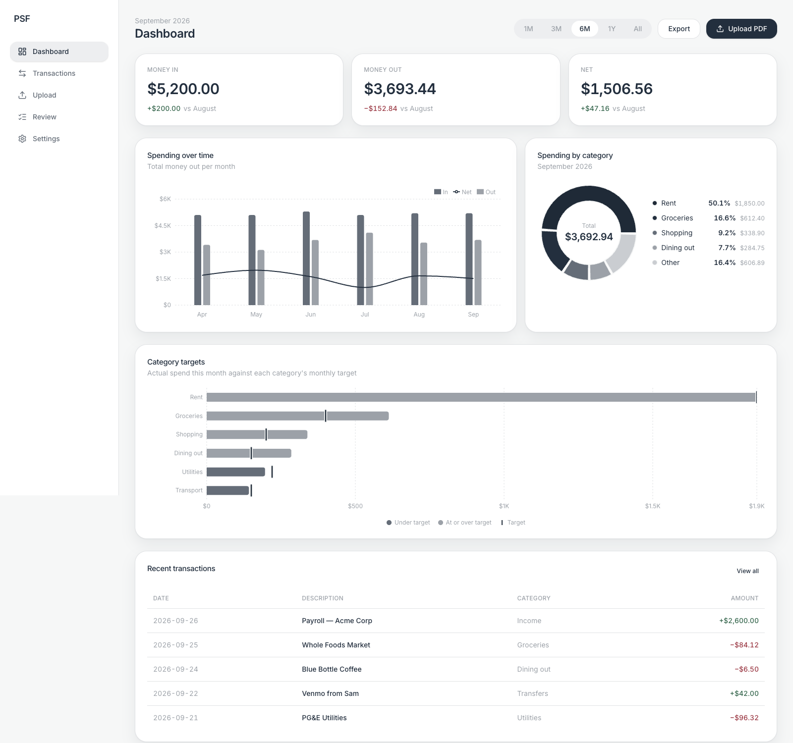

# PSF

Know where your money went. Upload your bank statement PDFs, AI sorts the spending, you check the results, everything stays on your computer.

**Try it live:** [psf-io.vercel.app](http://psf-io.vercel.app)

> ⚠️ **Chromium only (Chrome / Edge) for now.** PSF needs a browser API that Firefox and Safari don't have yet.



## How it works

1. **Pick a folder** — choose a folder on your computer. Everything saves there.
2. **Upload statements** — drop in your bank PDFs.
3. **Check the AI** — fix any category it got wrong.
4. **See your spending** — charts of where it all went.

## Privacy

- No backend, no accounts, no telemetry.
- Transactions and settings are saved as plain JSON in the folder you pick.
- Only the date, description, amount, and your category list go to OpenRouter for sorting — never the raw PDF.
- Your OpenRouter key lives in `settings.json`, in your folder.

More detail: [`SECURITY.md`](SECURITY.md) for the threat model, [`docs/prd.md`](docs/prd.md) for what PSF does (and doesn't do), [`docs/system-design.md`](docs/system-design.md) for how it's built.

## What you need

- A current desktop version of Chrome or Edge
- An OpenRouter API key for the AI part
- Node.js 20+, only if you're running it yourself

## Run it yourself

```bash
npm ci
npm run dev
```

Open the URL Vite prints, pick a folder, add your categories, and drop your OpenRouter key into Settings.

## Test and build

```bash
npm test
npm run lint
npm run build
```

## Deploy

PSF builds down to plain static files, so any static host works:

```bash
npm run build
```

Push the `dist/` folder up, serve it over HTTPS, and don't commit user data, `settings.json`, or any keys.

## Not here yet

- Firefox/Safari support.
- Cross-device sync or direct bank connections.

## Contributing

PRs welcome. Run `npm test`, `npm run lint`, and `npm run build` before opening one. [`docs/system-design.md`](docs/system-design.md) has the full picture of how the pieces fit together.

## License

See [`LICENSE`](LICENSE).
