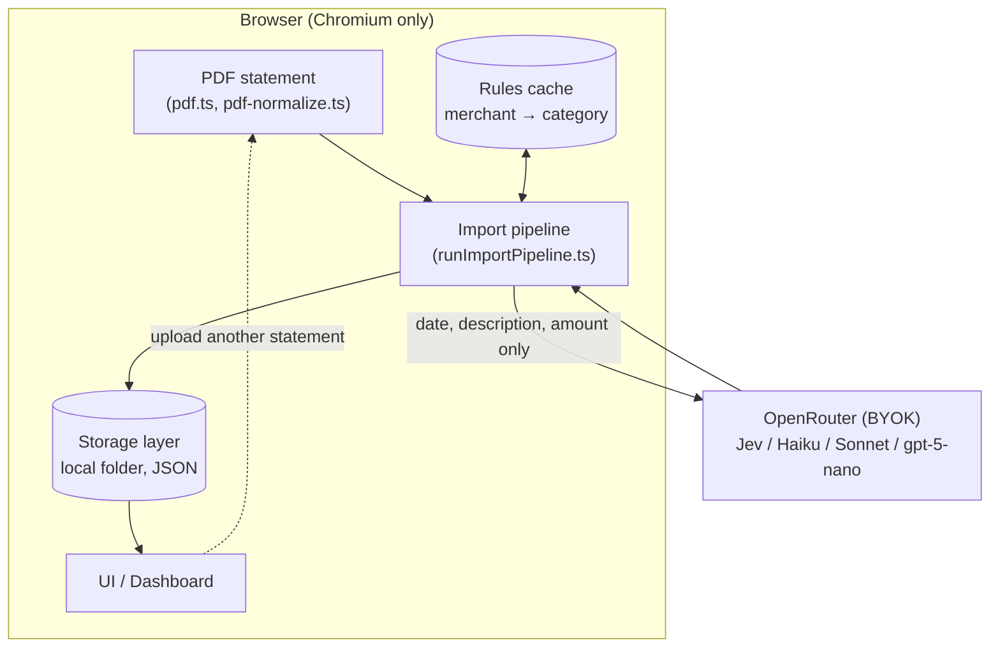
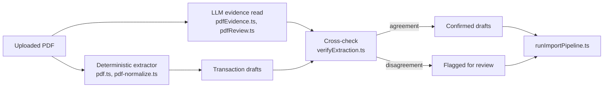
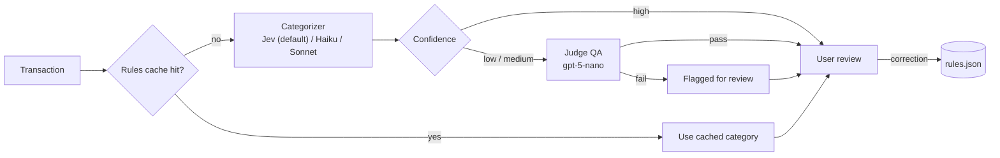

# PSF — System Design

Source requirements: [`prd.md`](prd.md)

## Overview

A fully client-side web app. No backend, no accounts, no telemetry. Everything — statement files, categorized transactions, rules, API key — lives in a folder on the user's own disk, picked once via the File System Access API.



## Storage layer

Real folder on disk, chosen once via `showDirectoryPicker()`. Layout:

```
/<user-picked-folder>/
  settings.json          # OpenRouter API key
  categories.json         # flat category list (editable, isTransfer flag per category)
  rules.json              # merchant -> category cache, built from corrections
  budgets.json            # optional monthly target per category
  accounts.json           # registered bank + account labels
  transactions/
    chase-checking-2025-11.json
    amex-platinum-2025-11.json
    ...
  debug/jev-vs-manual/    # PDF extraction QA logs, never read back by the app
```

Flat JSON per bank-account-month, read fully into memory and filtered/aggregated in JS — no SQLite, no query engine needed at this data scale.

Storage sits behind one interface, `StorageLayer` (`src/lib/types.ts`), so the on-disk format can change without touching the rest of the app: `readMonth`/`writeMonth`, `readCategories`/`writeCategories`, `readRules`/`writeRules`, `readBudgets`/`writeBudgets`, `readSettings`/`writeSettings`, `readAccounts`/`writeAccounts`.

## PDF import (`src/lib/adapters`, `src/lib/import`)

Statements go in as PDF only. Import runs in two independent passes that are then cross-checked against each other:



- **Deterministic extractor** (`pdf.ts`, `pdf-normalize.ts`) reads the statement line-by-line without any bank-specific logic — same code for every bank.
- **LLM evidence read** (`pdfEvidence.ts`, `pdfReview.ts`) asks a model to read the same pages and report back transactions with page/line evidence, rather than trusting it blind.
- **Cross-check** (`verifyExtraction.ts`) diffs the two reads; disagreements get flagged rather than silently resolved one way.
- A side-by-side comparison log is written to `debug/jev-vs-manual/` (`jevComparisonLog.ts`) for later review — never read back by the app itself.
- `runImportPipeline.ts` is the single entry point that ties extraction verification together with categorization (below) for one import.

## Categorization pipeline (`src/lib/categorization`)

For each transaction, in order:



1. **Rules cache lookup** (`rulesCache.ts`) — exact/fuzzy match on description, no LLM call on a hit.
2. **Categorizer call** (`pipeline.ts`) — cache misses go to one already-chosen `Categorizer`, bound to a model at construction (`categorizer.ts`). Default provider is **Jev** (`jevCategorize.ts`), a bounded-choice model via OpenRouter's Decisions API — it can only return a category id from the supplied list, never a free-text guess. Haiku/Sonnet/gpt-5-nano are available as alternate providers for experimentation.
3. **Judge QA** (`judge.ts`) — a cheap pass/fail check (`gpt-5-nano`), run only on already-flagged output (low/medium confidence, or an extraction disagreement), never the full batch. Fails open: any judge error is treated as "no flag," never as a blocked import.
4. **User review** — all results shown for confirm/correct. Corrections merge into `rules.json` immediately.

## Guard rails

- Boot check: `typeof window.showDirectoryPicker === 'function'`. If false, block with an explicit message naming supported browsers — no degraded mode.
- Folder handle invalid/revoked mid-session → explicit re-authorization prompt, never a silent fallback to browser storage or a server.
- Only `{description, amount, date}` is ever sent to OpenRouter — never raw PDF content, never account numbers.
- Every OpenRouter call (Jev, chat models, judge) goes directly from the browser with the user's own BYOK key — no backend proxy.

## Known risks

- No proven sync VFS for File System Access handles (unlike OPFS), so storage is flat JSON rather than an embedded database.
- Confidence thresholds for flagging are tuned empirically, not derived from a formal calibration.
- Bank/statement format drift is an ongoing maintenance cost for the PDF extractor, same as it would be for any adapter.
